# SOC Home Lab – SIEM Monitoring & Threat Detection Platform

## Overview

This project is a Security Operations Center (SOC) Home Lab built to simulate real-world security monitoring, threat detection, incident investigation, and threat hunting workflows using Splunk Enterprise.

The lab integrates Windows and Linux log sources, Sysmon endpoint telemetry, attack simulation using Kali Linux, custom detections, dashboards, alerts, and MITRE ATT&CK mapping.

## Architecture

```text
Kali Linux (Attacker)
        │
        ▼
Windows VM (Sysmon)
        │
        ▼
Splunk Universal Forwarder
        │
        ▼
AWS EC2 Ubuntu
Splunk Enterprise SIEM
        │
        ▼
Dashboards • Alerts • Investigations

Ubuntu Server (SSH Logs)
        │
        ▼
Splunk Enterprise
```

---

## Environment

### Infrastructure

* AWS EC2 Ubuntu Server
* Windows Virtual Machine
* Kali Linux Virtual Machine

### Security Tools

* Splunk Enterprise
* Splunk Universal Forwarder
* Sysmon

### Log Sources

* Windows Security Logs
* Sysmon Process Creation Events (Event ID 1)
* Sysmon Network Connection Events (Event ID 3)
* Linux Authentication Logs (`/var/log/auth.log`)

---

## Key Features

* Centralized log collection and monitoring
* Windows endpoint visibility using Sysmon
* Linux SSH authentication monitoring
* Custom Splunk detection rules
* SOC alert generation and investigation
* Threat hunting dashboards
* MITRE ATT&CK mapped detections
* Attack simulation using Kali Linux

---

## Detection Rules

### SSH Brute Force Detection

```spl
source="/var/log/auth.log" "Failed password"
| stats count by src_ip
| where count > 5
```

### PowerShell Execution Detection

```spl
index=main sourcetype=WinEventLog:Microsoft-Windows-Sysmon/Operational EventCode=1 Image="*powershell.exe"
```

### CMD Execution Detection

```spl
index=main sourcetype=WinEventLog:Microsoft-Windows-Sysmon/Operational EventCode=1 Image="*cmd.exe"
```

### External Network Connection Detection

```spl
index=main sourcetype=WinEventLog:Microsoft-Windows-Sysmon/Operational EventCode=3
DestinationIp!="127.0.0.1"
```

---

## Dashboards

### Windows Monitoring Dashboard

* Top Executed Processes
* Process Creation Trend
* PowerShell Activity Trend
* Top Destination Ports

### Linux Monitoring Dashboard

* Top Attacker IP Addresses
* SSH Attack Timeline
* Failed Authentication Monitoring

---

## Attack Simulations

### SSH Brute Force Attack

* Source: Kali Linux
* Target: Ubuntu Server
* Detection: Linux Authentication Logs

### PowerShell Activity

* Generated PowerShell execution events
* Detected using Sysmon Event ID 1

### Network Activity Monitoring

* Monitored outbound network connections
* Detected using Sysmon Event ID 3

### Nmap Reconnaissance

* Source: Kali Linux
* Target: Windows VM
* Result: Firewall filtered scan traffic

---

## MITRE ATT&CK Mapping

| Detection                 | Technique |
| ------------------------- | --------- |
| SSH Brute Force           | T1110     |
| Password Guessing         | T1110.001 |
| PowerShell Execution      | T1059.001 |
| Command Prompt Execution  | T1059.003 |
| Network Connections       | T1071     |
| Network Discovery         | T1049     |
| Network Service Discovery | T1046     |

---

## Screenshots

### Windows Monitoring Dashboard

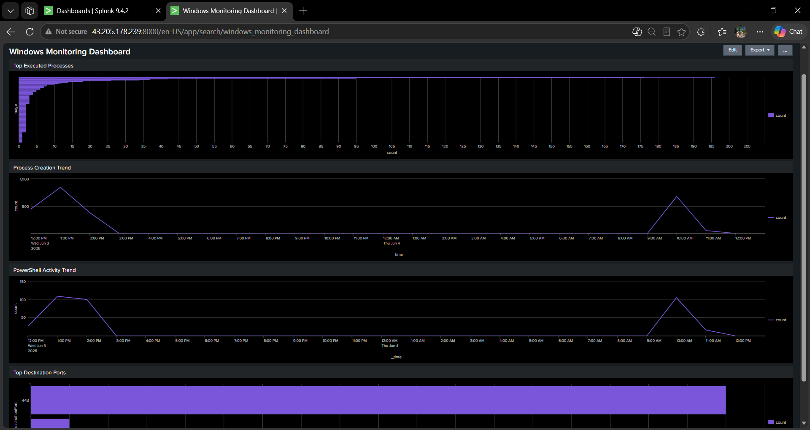

### Top Executed Processes

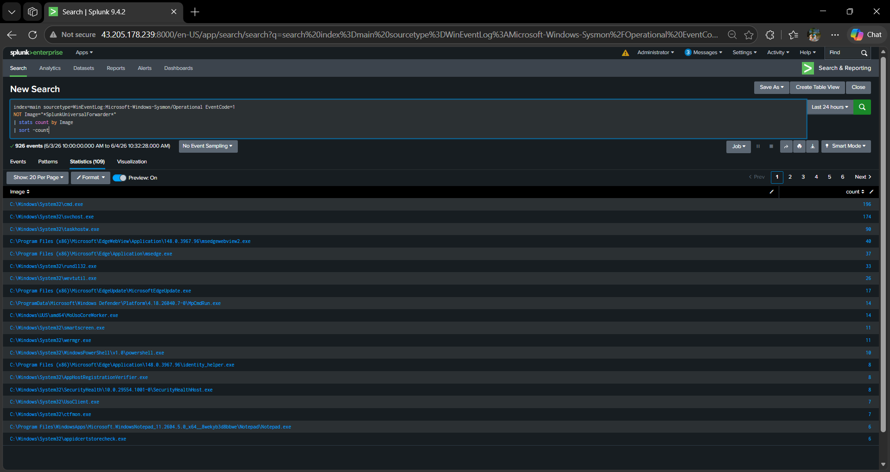

### Process Creation Trend

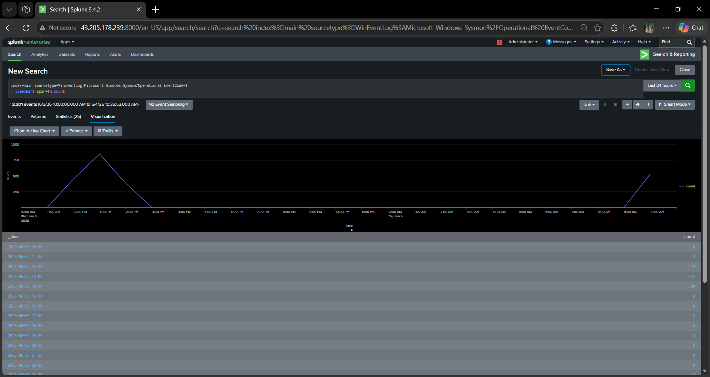

### PowerShell Activity Trend

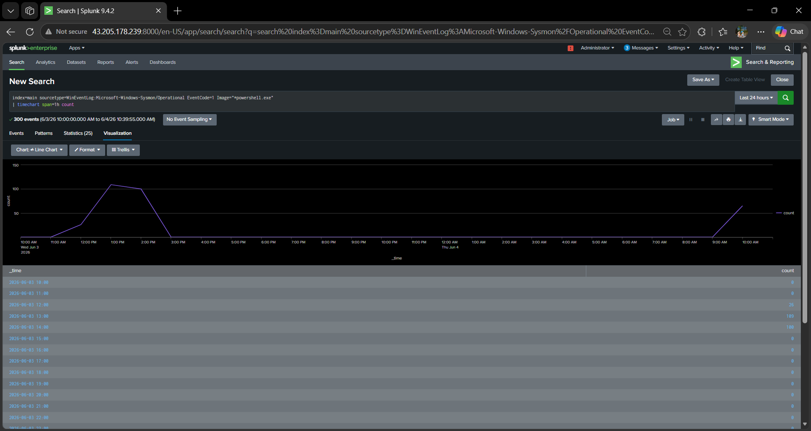

### Top Destination Ports

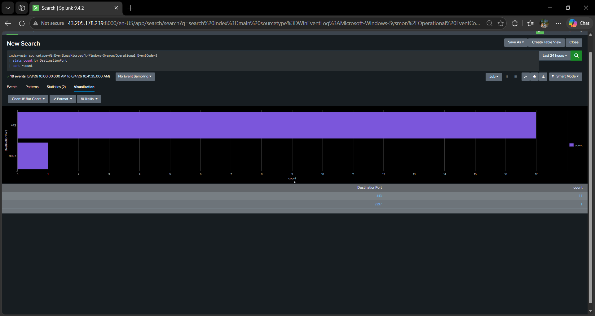

### PowerShell Execution Detection

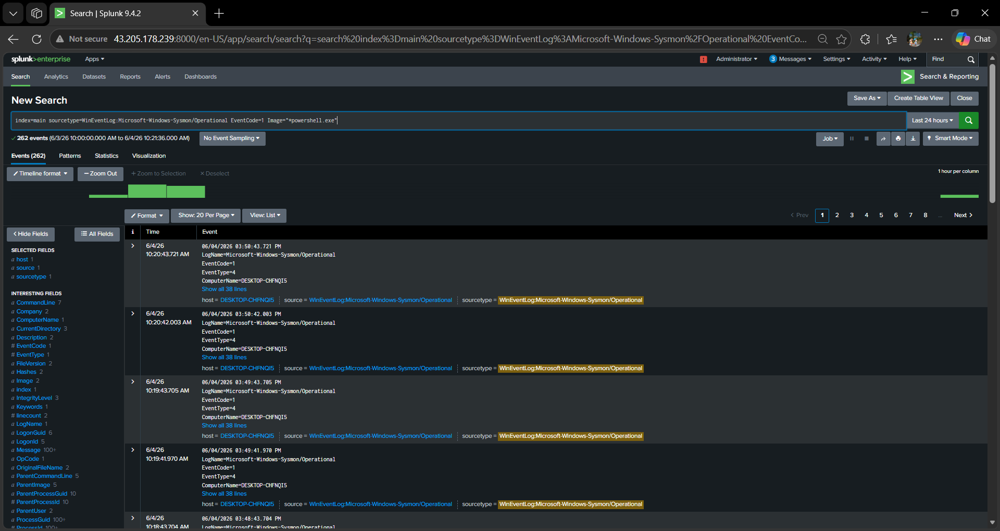

### CMD Execution Detection

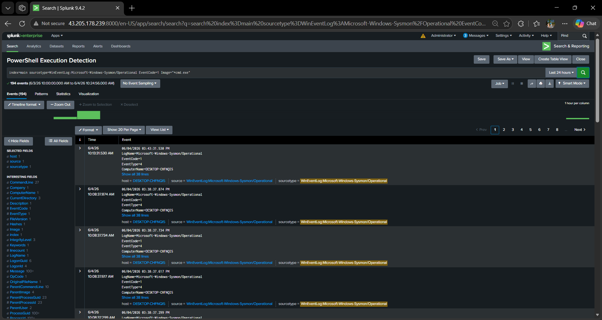

### Suspicious PowerShell Execution

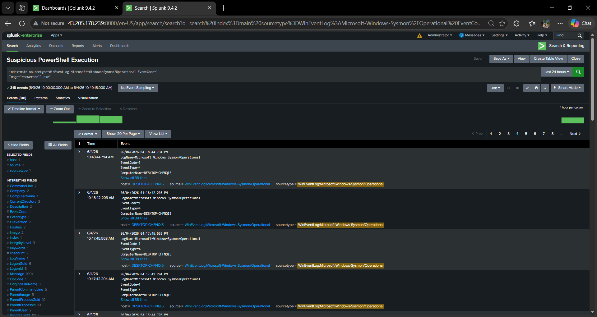

### External Network Connection Detection

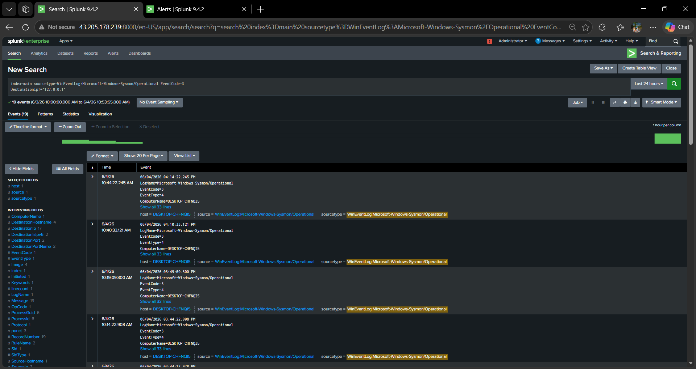

### SSH Brute Force Alert

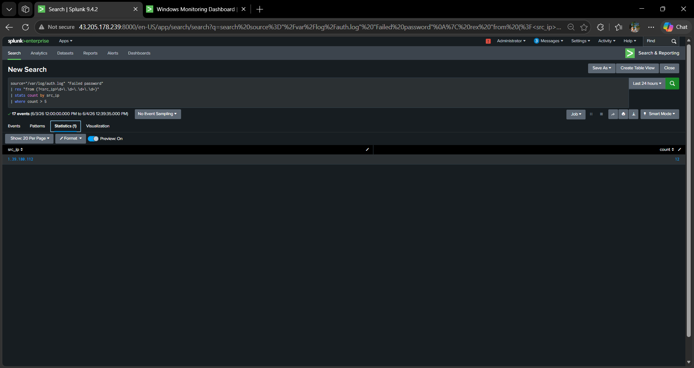

### Top Attacker IPs

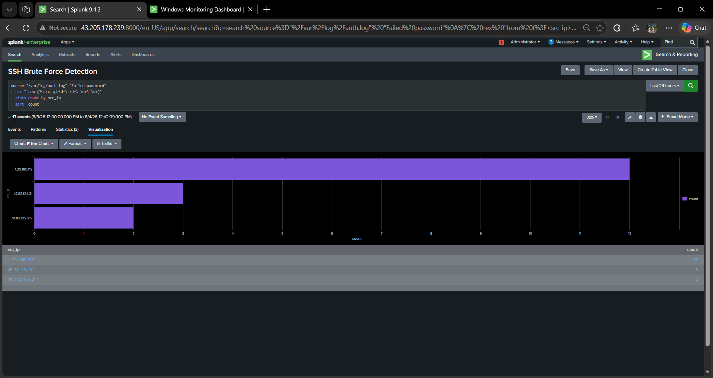

### SSH Attack Timeline

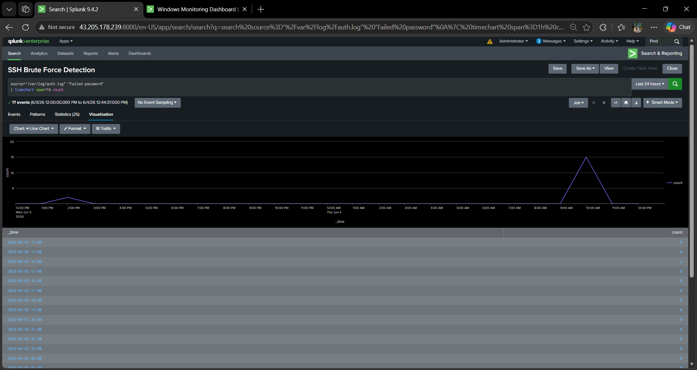

### Nmap Reconnaissance Evidence

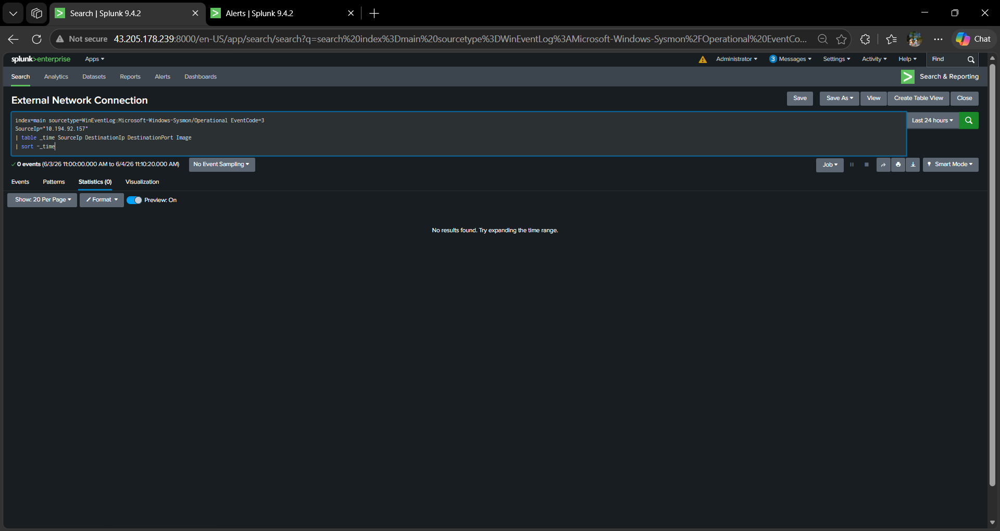

---

## Skills Demonstrated

* SIEM Monitoring
* Threat Detection
* Threat Hunting
* Incident Investigation
* Detection Engineering
* Windows Security Monitoring
* Linux Security Monitoring
* Sysmon Log Analysis
* Splunk Dashboard Development
* Alert Creation and Tuning
* MITRE ATT&CK Mapping
* Security Operations Center (SOC) Workflows

---

## Future Enhancements

* Integrate Windows Firewall auditing (Event IDs 5152/5157)
* Deploy Splunk Enterprise Security
* Add threat intelligence feeds
* Expand attack simulations
* Implement automated incident response workflows
* Create advanced correlation rules

---

## Repository Structure

```text
SOC-Home-Lab-SIEM-Monitoring-Platform
│
├── architecture/
├── dashboards/
├── detections/
├── incident-reports/
├── mitre-attack/
├── screenshots/
└── README.md
```

---

## Author

**Mahi H**

Aspiring SOC Analyst focused on SIEM monitoring, threat detection, incident response, threat hunting, and security operations.
